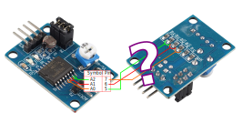

# Space-Mushroom in Adafruit's Circuit Python

Python to support a 6 Degrees Of Freedom (6dof) 'mouse' puck used primarily to support 3D modelling to Rotate/Pan/Zoom.

## Original source repo and 3D print files

This repo is forked from sh1ra's github repo here: [https://github.com/sh1ura/Space-Mushroom](https://github.com/sh1ura/Space-Mushroom)
The 3D Printable models for which are here: [https://www.printables.com/model/353764-space-mushroom-full-6-dofs-space-mouse](https://www.printables.com/model/353764-space-mushroom-full-6-dofs-space-mouse)

They do a much better job of explaining using it with example videos etc, so to find out about that head over to their pages.

## Circuit Python

This fork is to change the original Arduino software implementation with a Circuit Python implementation as my personal MCU of choice is the Raspberry Pi Pico.
Unfortunately the current Micropython builds for Raspberry Pi Pico doesn't have Human Interface Device (HID) implementation yet, or that would be my perfect choice as I feel the toolchain for that is much more mature than Adafruit's Circuit Python.

## Setup

First you need to get the latest stable build of the Circuit Python firmware from: [https://circuitpython.org/board/raspberry_pi_pico/](https://circuitpython.org/board/raspberry_pi_pico/)

For me at time of writing it was top of the page on the right, version 7.3.3, click the purple `DOWNLOAD .UF2 NOW` button.
When that's downloaded unplug your Pico (if it's plugged in), hold the `BOOTSEL` button on it and plug it into your computer, keep holding the button for a couple of seconds after plugging it in and you should see a new usb media device connected to your computer.
Copy and paste the file that was downloaded from circuitpython.org to the pico usb media device and it will automatically reboot the pico when it's finished.

You should now see a different usb media device, on my machine it's `CIRCUITPY`, in that device open up the `code.py` in any text editor and replace the contents with the following:

```python
import board
import digitalio
import time

led = digitalio.DigitalInOut(board.LED)
led.direction = digitalio.Direction.OUTPUT

while True:
    led.value = True
    time.sleep(0.5)
    led.value = False
    time.sleep(0.5)
```

...and save the file.
As soon as you save the file it will automatically run it and the LED on the Pico will start flashing!

This is all you need to set up to deploy code changes to Circuit Python on the Pico, it really is as simple as that :)

### Dependancies

Requires:

- adafruit-pcf8591
- adafruit-hid

## Analogue Pins

The Raspberry Pico only has 3 analogue pins, and the Space Mushroom needs 6, so to get around this I'll be using 2 PCF8591's to add 8 additional analogue input pins.

I could use just one PCF8591 and use the on board analogue pins, however the PCF8591 uses I2C to communicate the digital signals back to the Pico, so rather than have some of the inputs directly as analog reads and the others as digital it's simpler to manage if they are all of the same type.

There is a Adafruit Circuit Python library to manage PCF8591's (details [here](https://docs.circuitpython.org/projects/pcf8591/en/latest/).

### PCF8591 specifics

This is the layout of the pins on my PCF8591 boards:

| Symbol | Pin | Description                |
|--------|-----|----------------------------|
|  AOUT  |  15 | Analogue output            |
|  AIN0  |   1 | Analogue input             |
|  AIN1  |   2 | Analogue input             |
|  AIN2  |   3 | Analogue input             |
|  AIN3  |   4 | Analogue input             |
|  SCL   |  10 | I2C-bus serial clock in    |
|  SDA   |   9 | I2C-bus serial data in/out |
|  GND   |  13 | Analogue ground supply     |
|  VCC   |  16 | 3.3 from Pico pin 36       |
|   P4   |  NA | Onboard temperature sensor |
|   P5   |  NA | Onboard photoresistor      |
|   P6   |  NA | Onboard 10k trimpot        |

Also required

| Symbol | Pin | Description                |
|--------|-----|----------------------------|
|   A0   |  5  | Hardware slave address     |
|   A1   |  6  | Hardware slave address     |
|   A2   |  7  | Hardware slave address     |

These pins will need to be tapped directly from the chip pins to set the address of each board.
They need to be beeped out to find out where the pins are being shorted to set the address.
*note - googlage is showing that on some boards all three pins are shorted, so just by lifting individual legs of the chip, different addresses are potentially available. Will know more when they arrive.*



#### Implementation

** Board 1 ** 
 - AOUT is unused
 - Set address to 0x048 by lifting all three address pins (5,6 & 7)
 - P4/5/6 jumpers to be removed to enable AIN0/1/3 input pins
 - AIN0 connects to Stick1_VRX_PIN
 - AIN1 connects to Stick1_VRY_PIN
 - AIN2 connects to Stick2_VRX_PIN
 - AIN3 connects to Stick2_VRY_PIN
 - GND to Pico GND
 - VCC to Pico 3.3 on pin 36
 - SDA on Pico pin 0 GP0 I2C0 SDA
 - SCL on Pico pin 1 GP1 I2C0 SCL

** Board 2 ** 
 - AOUT is unused
 - Set address to 0x049 by lifting all but pin 5 address pins (6 & 7)
 - P4/5/6 jumpers to be removed to enable AIN0/1/3 input pins
 - AIN0 connects to Stick3_VRX_PIN
 - AIN1 connects to Stick3_VRY_PIN
 - AIN2 is unused
 - AIN3 is unused
 - GND to Pico GND
 - VCC to Pico 3.3 on pin 36
 - SDA on Pico pin 0 GP0 I2C0 SDA
 - SCL on Pico pin 1 GP1 I2C0 SCL